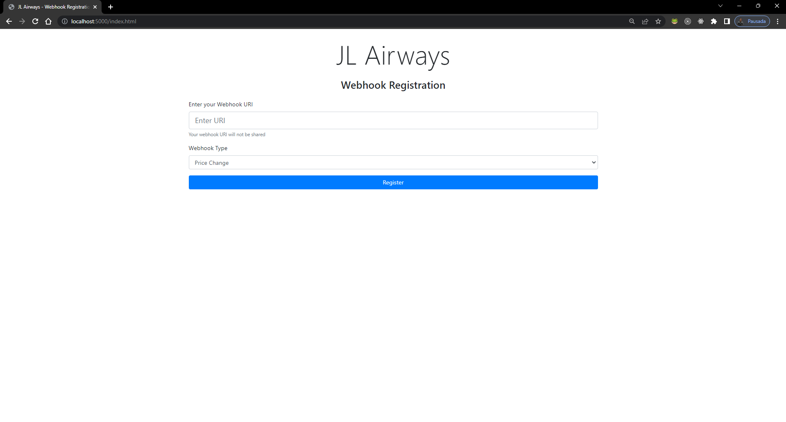
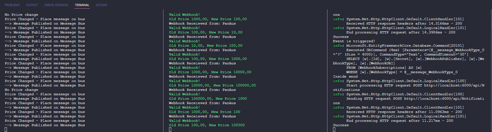

# Webhooks - Setor aéreo

Projeto desenvolvido para entendimento da utilização de webhooks. O case simula o setor aéreo em que as companhias podem alterar preços de vôos, assentos disponíveis e alterações/cancelamentos nos vôos e as agências de viagem recebem as atualizações via webhooks.


## Referência

 - [Udemy - Webhooks with .NET 5](https://www.udemy.com/course/webhooks-with-dotnet-5/)


## Rodando localmente

Para executar este projeto localmente:

Clone o projeto.

Entre na pasta clonada.

Executando o container Docker com os serviços de banco de dados e Mensageria:
```bash
  docker-compose up -d
```

Executando as migrations do EF Core (em cada uma das pastas AirlineWeb e TravelAgentWeb):
```bash
  dotnet ef database update
```

Após executar as migrations, execute os três projetos em terminais separados:
```bash
  dotnet run
```

O primeiro passo é registrar um "Webhook subscription", que pode ser feito no Postman ou no endereço:

http://localhost:5000/index.html




Exemplo de payload para o body do Post caso decida usar o postman:
{
    "WebhookUri": "http://localhost:6000/api/Notifications",
    "WebhookType": "pricechange"
}

Após o registro da webhook subscription, grave o Guid retornado na tabela SubscriptionSecrets do banco TravelAgentDB.

Crie um vôo usando o endpoint http://localhost:5000/Flights e o verbo POST no Postman ou outra ferramenta.

Exemplo de payload:


{
    "FlightCode": "JLX2023",
    "Price": 1000
}


Faça alterações neste vôo usando o verbo PUT e o payload abaixo:
{
    "FlightCode": "JLX2023",
    "Price": 1005
}

Observe os logs que serão gerados nos terminais abertos.

Exemplo:


## Autores

[Paolo Fullone](https://www.linkedin.com/in/paolofullone)

